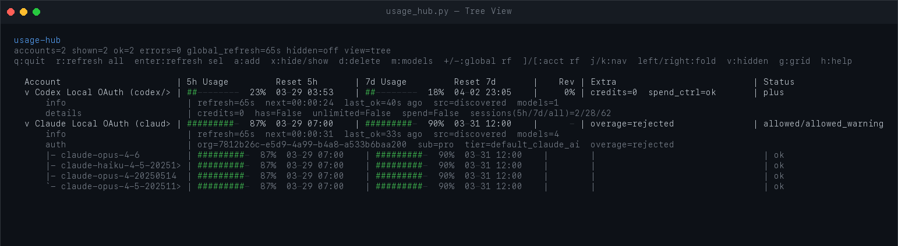
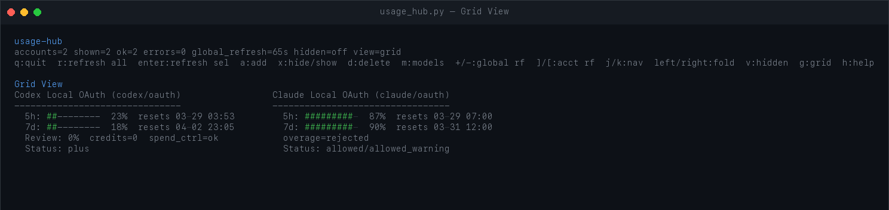

# Usage Dashboard

This repo now includes both:

- `usage_hub.py`: the original terminal dashboard built on `curses`
- `usage_hub_web.py`: a local interactive web dashboard for Claude and Codex/OpenAI usage
- `claude_sessions_dashboard.py`: a dedicated local dashboard for Claude Code session/project analytics from `~/.claude`
- `codex_sessions_dashboard.py`: a separate local web dashboard for Codex session history and token analytics

### Tree View
Expanded view with per-model usage breakdowns, auth details, and refresh timing.



### Grid View
Side-by-side account comparison with usage bars and reset countdowns.



## Prerequisites

- Python 3.9+
- `requests` library (`pip install requests`)
- macOS (uses Keychain for Claude OAuth credentials)

## Quick Start

```bash
cd UsageDashboard
python usage_hub.py
```

On first launch the dashboard prompts you to add an account (Claude OAuth, Codex OAuth, or OpenAI API key). Accounts are saved to `.local/usage_hub.json` so they persist between sessions.

## Web Dashboard

```bash
cd UsageDashboard
python usage_hub_web.py
```

By default it starts a local server at `http://127.0.0.1:8765/` and opens it in your browser.

### Web Features

- Interactive account cards with live usage windows and reset timing
- Detail view for probes, limits, session metadata, and account status
- Add new Claude or Codex/OpenAI API-key accounts from the browser
- Add new Claude OAuth or Codex OAuth connections from the browser
- Local OAuth discovery for built-in Claude and Codex credentials
- Refresh-all, per-account refresh, enable/disable, hide/show, and delete for user-added accounts

### Web Options

```bash
python usage_hub_web.py --host 127.0.0.1 --port 8765 --no-browser
```

```bash
python usage_hub_web.py --config /path/to/config.json
```

## Claude local session dashboard

For local Claude Code project/session analysis sourced from `~/.claude`:

```bash
python3 claude_sessions_dashboard.py
```

This dashboard shows:

- project and session views sourced from local Claude Code `.jsonl` session files
- inferred session state such as waiting, error, or rate-limited
- token totals extracted from per-message usage fields
- sliding windows such as 5-day and 7-day token totals
- day/hour activity breakdowns with project/session attribution

See `Claude/docs/claude_local_data_dashboard.md` for the data layout and extraction notes.

## Codex Sessions Dashboard

```bash
cd UsageDashboard
python codex_sessions_dashboard.py
```

By default it starts a local server at `http://127.0.0.1:8877/` and reads local session logs from `~/.codex/sessions`.

### Codex Sessions Features

- Sliding-window token totals from local Codex sessions
- Presets for `5h`, `24h`, `5d`, `7d`, `30d`, and `all`
- Custom date-range selection
- Project rollups with recent access timestamps and lifetime totals
- Session rollups with per-session token totals, duration, message counts, and context-window size
- Hourly or daily timeline view with top projects and sessions in each bucket

### Codex Sessions Options

```bash
python codex_sessions_dashboard.py --host 127.0.0.1 --port 8877 --sessions-dir ~/.codex/sessions --no-browser
```

### Skip the startup prompt

```bash
python usage_hub.py --no-startup-prompt
```

### Use a custom config file

```bash
python usage_hub.py --config /path/to/config.json
```

## Keyboard Controls

| Key | Action |
|-----|--------|
| `q` | Quit |
| `r` | Refresh all accounts |
| `Enter` | Refresh selected account |
| `a` | Add a new account |
| `d` | Delete selected account |
| `x` | Hide / show selected account |
| `v` | Toggle visibility of hidden accounts |
| `m` | Edit models for selected account |
| `+` / `-` | Increase / decrease global refresh interval |
| `]` / `[` | Increase / decrease per-account refresh interval |
| `j` / `k` | Navigate up / down |
| `Left` / `Right` | Fold / unfold account details |
| `g` | Toggle grid view |
| `h` | Show help |

## Account Types

| Type | Auth Method | What it tracks |
|------|------------|----------------|
| **Claude OAuth** | macOS Keychain token | Per-model usage via Anthropic API |
| **Codex OAuth** | `~/.codex/auth.json` | Aggregate ChatGPT/Codex usage |
| **OpenAI API** | API key | Per-model usage via OpenAI API |

## File Layout

```
UsageDashboard/
  usage_hub.py          # Main dashboard script
  usage_hub_web.py      # Local web dashboard
  codex_sessions_dashboard.py # Codex session analytics dashboard
  .local/               # Local config & credentials (git-ignored)
  Claude/               # Claude auth scripts & docs
  Codex/                # Codex/OpenAI auth scripts & docs
```
